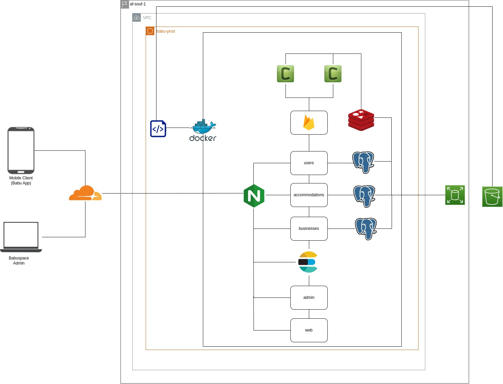

# Babu

## Quick glance at our infrastrastructure(out-dated diagram!)

## Some interesting links

- [Sys Design and Anlysis Board](https://miro.com/welcomeonboard/cnRuUUk2dHdXQlVBNjI2MUUzdDFsS1VXWG90NUVUV0lBcDBTYllNWmJ5R1dWTFFwRzBhWjlVRGF5N0J6TUtzNnwzNDU4NzY0NTQzNzAyNjc2NDE0fDI=?share_link_id=760526281243)
- [UI Prototypes](https://app.diagrams.net/#G1ZfAKYufVQ6pN6JanJ3m5k8tYlW1OAS1u)

## Our tech stack

We value ownership and are huge fans of microservices.
Our appliactions are built with simplicity in mind and from our previous experience.
Here are a few predominant technologies we use or intennd to use.

### Web Technologies

- Animate.css
- Bootstrap
- CSS
- HTML
- JavaScript
- JQuery

### Backend Technologies
- AWS
- NGINX
- Python
- Django Rest Framework
- Docker
- Kubernetes
- Postgres
- Redis

## Project Management, collaboration and tracking

- GitHub Projects
- Miro
- Draw.io

## CI/CD

- Git
- GitHub
- Pre-commit
- GitHub Actions
- DockerHub
- Pytest
- Semantic Release

## Monitoring

- Prometheus
- Grafana

## What you ned to know to contribute

We use Git to collaborate on all our projects. We value heatlhy relationships between our teams as well as clean and maintanable code. Hence, we can't stress enough how much respecting best practices is important. We use the [Angular Commit Messsage Covention](https://gist.github.com/brianclements/841ea7bffdb01346392c) and our contributions always pass through [Pull Requests](https://docs.github.com/en/pull-requests/collaborating-with-pull-requests/reviewing-changes-in-pull-requests/about-pull-request-reviews) reviews.